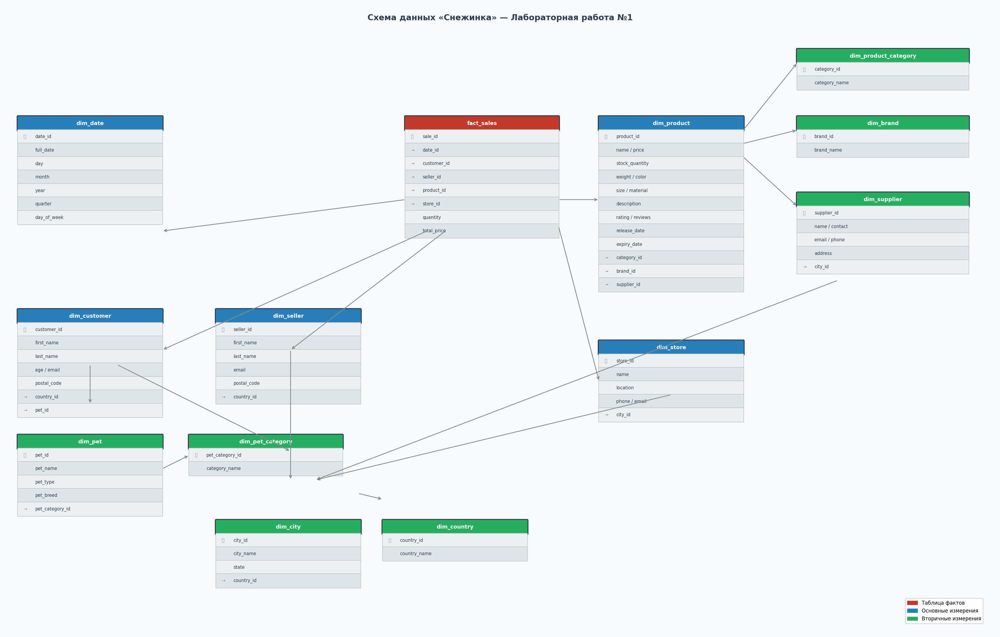

# Отчёт по лабораторной работе №1
**Тема:** Нормализация данных в схему «снежинка»  
**Дисциплина:** Анализ больших данных

---

## Что было сделано

Исходные данные — 10 CSV-файлов (`MOCK_DATA.csv`, `MOCK_DATA (1).csv` … `MOCK_DATA (9).csv`) по 1000 строк каждый, итого 10 000 строк. Данные описывают транзакции магазина товаров для домашних животных: покупатели, продавцы, поставщики, магазины, товары, питомцы.

Все данные трансформированы из плоской таблицы-источника в аналитическую модель «снежинка».

---

## Структура проекта

```
BDSnowflake/
├── исходные данные/        # 10 CSV-файлов с исходными данными
├── sql/
│   ├── 01_source.sql       # DDL staging-таблицы mock_data
│   ├── 02_load.sql         # Загрузка CSV в mock_data через COPY
│   ├── 03_ddl.sql          # DDL таблиц фактов и измерений
│   └── 04_dml.sql          # DML заполнения таблиц из mock_data
├── docker-compose.yml      # PostgreSQL 16, автозапуск скриптов
└── REPORT.md
```

---

## Схема данных



### Таблица фактов

**`fact_sales`** — одна строка на каждую продажу.  
Метрики: `quantity` (количество), `total_price` (сумма).  
Внешние ключи: дата, покупатель, продавец, товар, магазин.

### Таблицы измерений (12 штук)

| Таблица | Что хранит | Ссылается на |
|---|---|---|
| `dim_date` | Дата продажи с разбивкой по дню/месяцу/году/кварталу | — |
| `dim_country` | Страны (покупателей, продавцов, магазинов, поставщиков) | — |
| `dim_city` | Города и штаты | `dim_country` |
| `dim_customer` | Покупатель | `dim_country`, `dim_pet` |
| `dim_seller` | Продавец | `dim_country` |
| `dim_pet_category` | Категория питомца (Dog, Cat, …) | — |
| `dim_pet` | Питомец покупателя (имя, порода, тип) | `dim_pet_category` |
| `dim_product_category` | Категория товара | — |
| `dim_brand` | Бренд товара | — |
| `dim_supplier` | Поставщик | `dim_city` |
| `dim_product` | Товар (цена, вес, цвет, рейтинг и др.) | `dim_product_category`, `dim_brand`, `dim_supplier` |
| `dim_store` | Магазин | `dim_city` |

Схема является снежинкой: измерения нормализованы до 3-го уровня (например, `fact_sales → dim_product → dim_supplier → dim_city → dim_country`).

---

## Запуск

```bash
docker-compose up
```

PostgreSQL поднимается и автоматически выполняет скрипты из `sql/` в порядке нумерации: создаётся staging-таблица, загружаются CSV, создаются таблицы схемы снежинки, заполняются данными. После запуска база `petshop` готова к работе.

Подключение: `host=localhost port=5432 db=petshop user=postgres password=postgres`

---

## Итог

Все 10 000 строк исходных данных трансформированы в нормализованную аналитическую модель. Схема позволяет анализировать продажи в разрезе времени, географии, товаров, покупателей, продавцов и магазинов.
