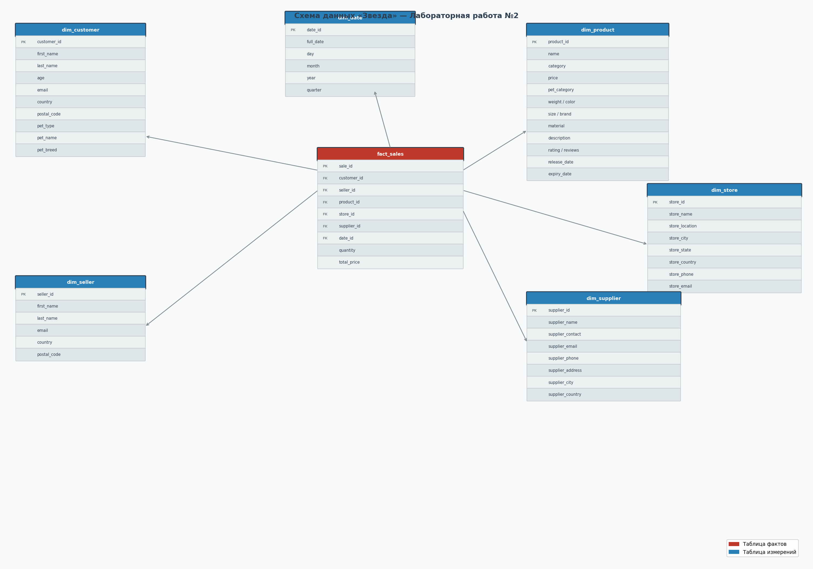

# Лабораторная работа №2 — ETL на Apache Spark

## Цель работы

Реализовать ETL-пайплайн на Apache Spark: загрузить исходные данные о продажах, трансформировать их в модель «звезда» в PostgreSQL, а затем на основе этой модели сформировать аналитические отчёты в нескольких базах данных.

---

## Что было сделано

### Исходные данные

Взял 10 CSV-файлов с данными о продажах товаров для животных — клиенты, продавцы, продукты, магазины, поставщики. Всего 10 000 записей. Файлы загружаются в PostgreSQL автоматически при старте контейнера.

### Модель «звезда»



Написал Spark-джоб, который разбирает плоскую таблицу `mock_data` на отдельные измерения и таблицу фактов:

- `dim_customer` — клиенты
- `dim_seller` — продавцы
- `dim_product` — товары с характеристиками и рейтингами
- `dim_store` — магазины
- `dim_supplier` — поставщики
- `dim_date` — календарное измерение (день, месяц, квартал, год)
- `fact_sales` — факты продаж со всеми внешними ключами

### Аналитические отчёты

На основе модели «звезда» сформировал 6 витрин данных:

1. **Продукты** — топ продаваемых товаров, выручка по категориям, рейтинги
2. **Клиенты** — топ покупателей, средний чек, распределение по странам
3. **Время** — месячные и годовые тренды продаж
4. **Магазины** — топ магазинов по выручке, разбивка по городам и странам
5. **Поставщики** — топ поставщиков, средняя цена товаров
6. **Качество** — рейтинги товаров, корреляция рейтинга с объёмом продаж

Каждая витрина записана в пять баз данных:

| База данных | Тип | Статус |
|---|---|---|
| ClickHouse | Колоночная СУБД | обязательно |
| Cassandra | Wide-column NoSQL | бонус |
| Neo4j | Графовая БД | бонус |
| MongoDB | Документная NoSQL | бонус |
| Valkey | Key-value хранилище | бонус |

### Инфраструктура

Всё поднимается одной командой через Docker Compose. Написал отдельный `Dockerfile` для Spark с нужными зависимостями. Инициализация PostgreSQL и Cassandra происходит автоматически при первом запуске.

---

## Структура репозитория

```
BigDataSpark/
├── docker-compose.yml          # вся инфраструктура
├── Dockerfile.spark            # образ Spark с зависимостями
├── HOWTO.md                    # инструкция запуска
├── исходные данные/            # 10 CSV-файлов (10 000 строк)
├── init/
│   ├── postgres/               # SQL-скрипт создания таблицы и загрузки CSV
│   └── cassandra/              # CQL-скрипт создания keyspace и 6 таблиц
└── jobs/
    ├── 01_star_schema.py       # ETL: плоская таблица → модель звезда
    ├── 02_clickhouse_reports.py
    ├── 03_cassandra_reports.py
    ├── 04_neo4j_reports.py
    ├── 05_mongodb_reports.py
    └── 06_valkey_reports.py
```

---

## Запуск

Подробная инструкция — в файле [`BigDataSpark/HOWTO.md`](BigDataSpark/HOWTO.md).

Кратко:

```bash
cd BigDataSpark
docker-compose up -d --build

# ETL в модель звезда
docker exec spark spark-submit \
  --master "local[*]" \
  --packages "org.postgresql:postgresql:42.7.3" \
  /opt/spark-jobs/01_star_schema.py

# Отчёты в ClickHouse
docker exec spark spark-submit \
  --master "local[*]" \
  --packages "org.postgresql:postgresql:42.7.3" \
  /opt/spark-jobs/02_clickhouse_reports.py
```
